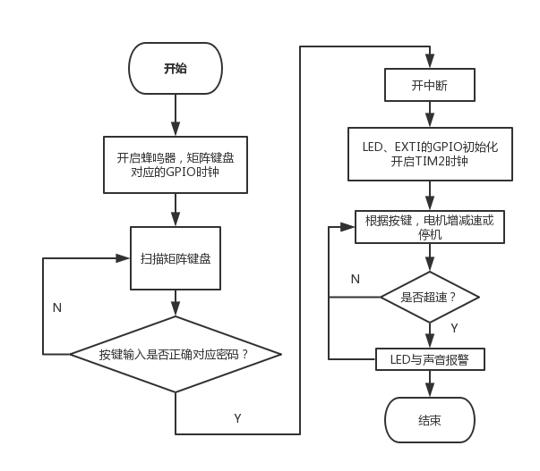
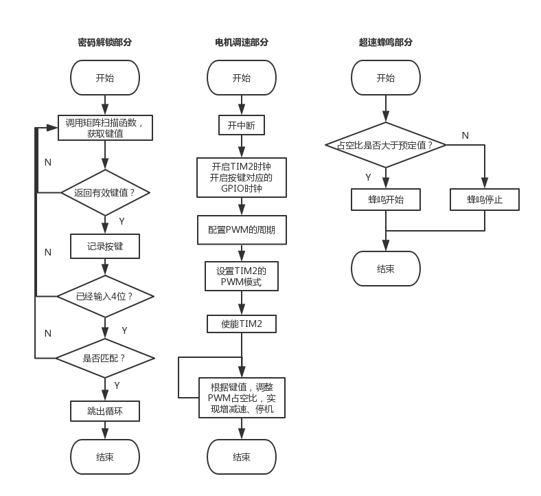
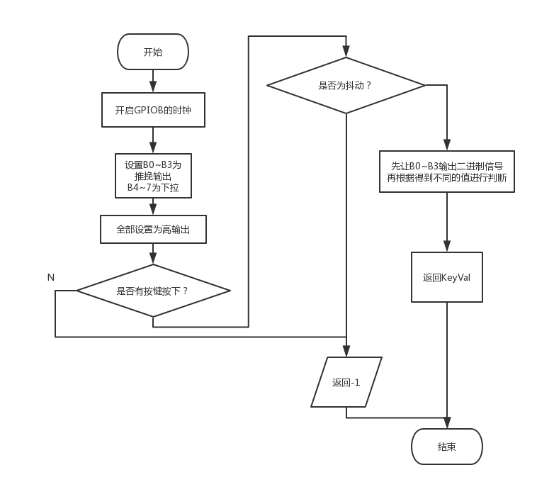

# 直流电机调速

## 主要文件

- [main.c](User/main.c)
- [bsp_pwm_output.c](User/PwmOutput/bsp_pwm_output.c)
- [bsp_exti.c](User/Key/bsp_exti.c)
- [universe.c](User/Universe/universe.c)
- [buzzer.c](User/Buzzer/buzzer.c)
- [bsp_led.c](User/Led/bsp_led.c)
- [bsp_key.c](User/Key/bsp_key.c)

## 方案

基本：控制电机的启动、停止和调整转速。对于直流电机来讲，使用 PWM 来驱动电机是控制转速的一种方法，而 STM32 通用定时器提供了输出 PWM 脉冲的功能，故决定通过通用定时器控制 GPIO 进行脉冲输出。

扩展：显示速度、超速报警、开机解锁。针对速度显示，使用 LED 灯的数量代表速度档位；针对超速报警，超过，则报警（LED 或声音）；针对开机解锁，开机输入四位密码，输入正确解锁，错误则报警，直至重启。

## 具体实现

1. 控制电机的具体实现：利用EXTI按键中断，在中断函数中调用PWM调节函数来调整PWM占空比，实现调节电机转速。
2. 显示速度档位的具体实现：在调节转速的函数中调用LED显示函数，LED显示函数根据形参对LED亮灭个数进行配置，实现速度档位显示。
3. 开机密码锁的具体实现：要点是编写矩阵键盘扫描函数，主函数将在一开始时进入循环，调用扫描函数，来判断是否符合正确密码的要求。

## 器件或模块选择

- 直流电机
- GPIO 模块
- TIM 模块
- 矩阵键盘
- LED 灯

## 主程序流程图设计



## 具体功能流程图设计





## 关键问题或程序关键段落说明

1. 驱动蜂鸣器：相应的 GPIO 口应该设置为 OD 输出
2. 如何能判断扫描到的数值有效？可以先将扫描到的键值赋给一个变量，检查该变量是否符合要求。
3. 中断服务中如何修改 PWM 占空比？可以调用增速、减速或停止的函数，函数中修改电平跳变时间。

## 程序关键段落说明

### 按键中断服务函数

```c
void EXTI9_5_IRQHandler(void)                               //E5按键
{
    if(EXTI_GetITStatus(EXTI_Line5) != RESET) //确保是否产生了EXTI Line中断
    {
        speedup();                              //增速
        Delay(5);
        EXTI_ClearITPendingBit(EXTI_Line5);     //清除中断标志位
    }  
}
void EXTI4_IRQHandler(void)                                 //E4按键
{
    if(EXTI_GetITStatus(EXTI_Line4) != RESET)
    {
        speeddown();                            //减速
        Delay(5);
        EXTI_ClearITPendingBit(EXTI_Line4);
}
}
void EXTI3_IRQHandler(void)
{
  if(EXTI_GetITStatus(EXTI_Line3) != RESET) //E3按键
    {
        stop();                                 //停转
    LEDchange(0);
        Delay(5);
        EXTI_ClearITPendingBit(EXTI_Line3);
  }
}
```

### 改变电平跳变时间以改变 PWM 占空比

```c
void speedup(void)
{
    if(CCR2_Val!=1000)
    {
      CCR2_Val= CCR2_Val +100;      //增大电平跳变值，增加高电平的时间
      TIM2_Mode_Config();           //重配PWM输出
        LEDchange(1);               //调用LED改变数目的函数，增加显示的速度档位
    }
    else
    {
        alert = 1;
    }
}

void speeddown(void)
{
    if(CCR2_Val!=200)
    {
      CCR2_Val= CCR2_Val -100;  //减小电平跳变值，减少高电平的时间
      TIM2_Mode_Config();   
        LEDchange(-1);            //调用LED改变数目的函数，减少显示的速度档位
    }
    if(alert==1)
    {
        alert = 0;
    }
}

void stop(void)
{
    CCR2_Val= 100;
    TIM2_Mode_Config(); 
    if(alert==1)
    {
        alert = 0;
    }
}
```

### 密码检测及报警判断

```c
int main(void)
{   
    int i = 0;
    char passwd[4] = {'B','0','6','C'};     //定义密码变量
    char user[4] = {'G','G','G','G'};           //定义用户密码，初始值均为G
    char key_test;

    BUZZER_GPIO_Config();
    Key_GPIO_Config();  

    while(1)                            
    {      
        key_test = pressedkey();    //扫描矩阵按键
        if(key_test!='G')                   //如果矩阵键盘有键按下
        {
            Buzzeralert_start();        //按键提示音
            user[i] = key_test;
            i = i+1;
            Delay(300);
            Buzzeralert_stop();
        }
        if(user[3]!='G')                    //如果用户输完4位密码
        {
            if(user[0]==passwd[0]&&user[1]==passwd[1]&&user[2]==passwd[2]&&user[3]==passwd[3]) break;   //如果密码正确，跳出循环，正常运行程序
        }
    }
    
    CLI();  //关闭总中断
    SEI();  //开放总中断
    
    /* LED GPIO 初始化*/
  LED_GPIO_Config();    
    
    /* EXTI 配置 */
    EXTI_PE_Config();   //以E3、E4、E5作为按键中断的GPIO口
    
    /* TIM2 PWM波输出初始化,并使能TIM2 PWM输出 */
    TIM2_PWM_Init();
    
    /* 等待中断，并检测是否应该报警 */
    while (1)
    {
        if(alert==1)
        {
            LEDalert();                     //LED闪烁报警
            Buzzeralert_start();    //蜂鸣器发出声音
        }
        else
    {
          Buzzeralert_stop();
        }
    }
}
```

### 蜂鸣器相关函数


```c
void BUZZER_GPIO_Config(void)
{       
    /*定义一个GPIO_InitTypeDef类型的结构体*/
    GPIO_InitTypeDef GPIO_InitStructure;
    /*开启GPIOD外设时钟*/
    RCC_APB2PeriphClockCmd( RCC_APB2Periph_GPIOD, ENABLE); 
    /*选择要控制的GPIOD引脚*/                                                              
    GPIO_InitStructure.GPIO_Pin = GPIO_Pin_4;   
    /*设置引脚模式为通用推挽输出*/
    GPIO_InitStructure.GPIO_Mode = GPIO_Mode_Out_OD;   
    /*设置引脚速率为50MHz */   
    GPIO_InitStructure.GPIO_Speed = GPIO_Speed_50MHz; 
    /*调用库函数，初始化GPIOC*/
    GPIO_Init(GPIOC, &GPIO_InitStructure);  
    /* 停响蜂鸣器 */
    GPIO_SetBits(GPIOD, GPIO_Pin_4);
}

void Buzzeralert_start()
{
    GPIO_ResetBits(GPIOD, GPIO_Pin_4);
}

void Buzzeralert_stop()
{
    GPIO_SetBits(GPIOD, GPIO_Pin_4);
}
```

